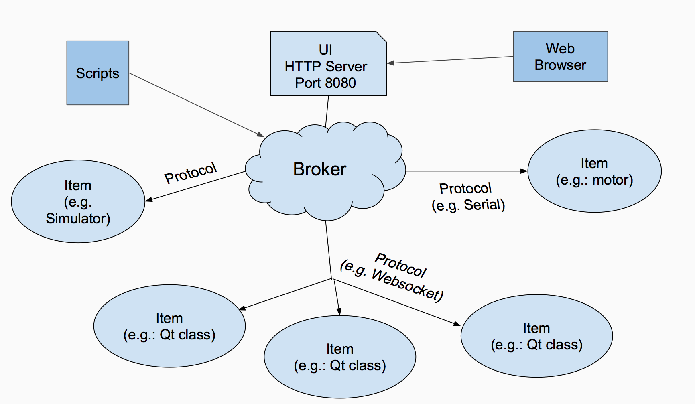
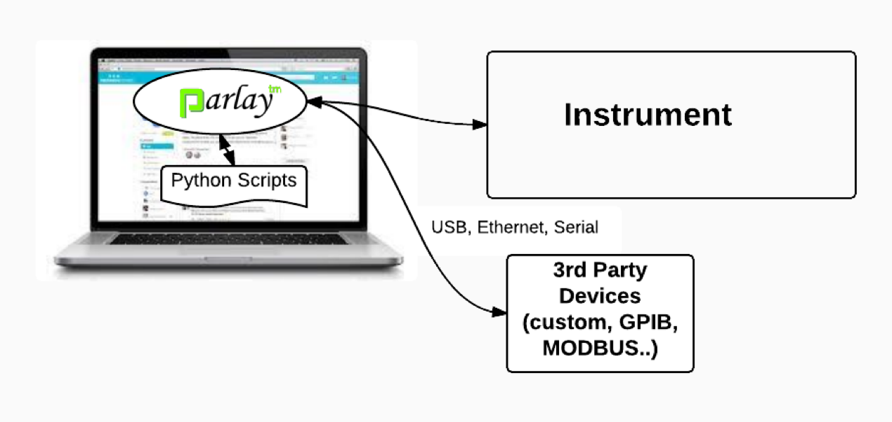
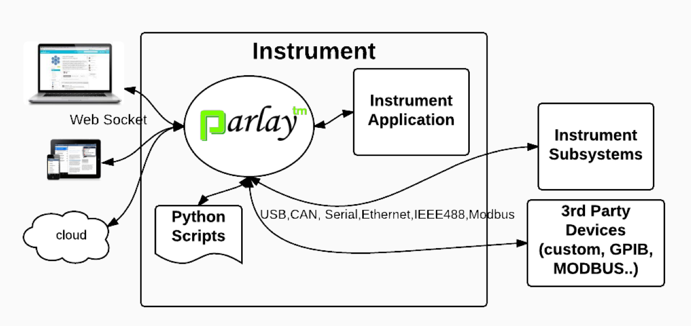

===============================
Overview of Parlay Architecture
===============================

Core Concepts
-------------

Items
~~~~~

In Parlay, an Item represents something physical (e.g. motor) or logical
(e.g. scheduler). Every item has an 'ID' and a ‘Name’.

The ID determines the Item’s identity, and must be unique among all items
connected to the Parlay broker. It can be a string or a number. The
broker uses the Item's ID to correctly route messages.

In the most general case, an Item is an object that can send and receive
messages that are routed by the Parlay broker. However, when creating
your own Items, you will inherit from Parlay Item classes that provide
more functionality out of the box.

Parlay provides two standard components for Items that are supported
by the built-in User Interface and by Parlay scripts:

* Commands: Take arguments and return a result or perform an action
* Properties:
  - Can be "GET" and "SET" dynamically
  - Can be streamed at a specified rate, or whenever they change

Discovery
~~~~~~~~~

One of the most powerful features of Parlay is discovery: finding out
what items are connected (and how they are connected) in real time,
rather than hard-coding them up-front. For example, you can write a
`script <src/scripts>`__ that sends various commands to a
serial motor controller item with the ID of "Motor1". You can plug that
motor controller into any COM port on your PC, or even write a simulator
in python that simulates the communication with that motor controller.
As long as the item returns the ID "Motor1" during the discovery
operation, your script will work with zero changes.

The Broker
~~~~~~~~~~

At the core of Parlay is the Broker.  It is a publish/subscribe message broker that allows all items
to send messages to each other.

The broker automatically provides a websocket server that listens for incoming connections from
the various Parlay integration libraries (.Net, Qt, JS, etc.)

The broker also provides a webserver that serves the built-in browser-based user interface.

Messages
~~~~~~~~

Commands and responses, getting and setting properties, and asynchronous
events are all implemented as JSON messages that are routed through the broker.

*Example Command message from a script to an Item:*

.. code-block:: javascript

    {
        "TOPICS": {
            "FROM": "script.simple_script.py",
            "TO": "CheerfulPerson",
            "MSG_ID": 100,
            "MSG_TYPE": "COMMAND",
            "RESPONSE_REQ": True,
            "TX_TYPE": "DIRECT"}
        },

        "CONTENTS": {
            "COMMAND": "say_hello"
        }
    }

Protocols
~~~~~~~~~

The broker supports custom protocols written in Python that can integrate with components that
  do not natively speak the Parlay protocol. Got an off-the-shelf USB camera or serial motor controller
  that you want to hook up to Parlay?  Write a custom protocol for it (see how below) and it will
  be connected to the Parlay system, and can be controlled by the browser UI, scripts, and any other item
  connected to the system.

Two ways of running Parlay
--------------------------

Parlay is cross-platform, and it is designed to run either on a PC or an
embedded system.

PC Rapid Prototyping Mode
~~~~~~~~~~~~~~~~~~~~~~~~~

Parlay can be installed on your PC to aid development. This is how you
would most likely work with Parlay during the early stages of product development.

Device Embedded Mode
~~~~~~~~~~~~~~~~~~~~

Parlay can also be installed on any embedded device that runs an
operating system that supports Python, such as any version of Linux or
Windows. Parlay is designed to be incorporated as a key component of
your product. It provides powerful service and diagnostic capabilities
to production devices.

