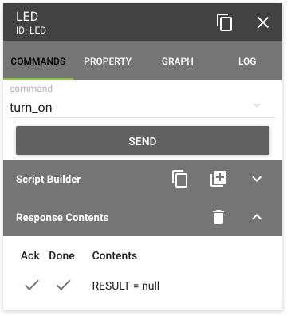
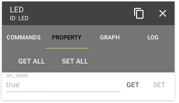

=======================
Example: Control an LED
=======================

An Item is a software object that represents a single piece of functionality.
For example, an item can represent an LED on a board. An item could also represent
an array of LEDs, or a temperature controller, or almost anything.

Items can communicate with each other, and it is common to build a hierarchy of items,
starting with low-level items that directly control hardware, then higher-level items
that control an entire subsystem consisting of several lower-level items.

Let's go through an example.

For demonstration purposes, we will ignore some complexities that we would have to address
in a realistic system, so that we can understand what Parlay provides.  For instance, the following
code is *not thread safe*.  It is not difficult to make this code usable for production, and
we will do just that in a later tutorial.

Introduction
------------

If you have an LED on your board that you want to control, you can create an LED item.

What things might you want to do with an LED?
  * read its current state
  * turn it on or off
  * blink at a certain rate (maybe...)
  * whatever else you think is useful...

Let's represent the on/off state of the LED with a property called "on".
You can read that property to find out the current state.
You can even stream that property to get automatic updates as it changes (more on that later).

.. note::
  Parlay does not provide code that interfaces with your hardware directly.  Parlay
  is a framework that takes your code that interfaces with the hardware, and makes it
  accessible and easy to control.

The code following example assumes you are running Parlay on a Raspberry Pi, using the python
RPi.GPIO package.

Define the LED Class with a Property
------------------------------------

.. code-block:: python

    # led.py

    import RPi.GPIO as GPIO

    from parlay import local_item, ParlayCommandItem, ParlayProperty, parlay_command

    @local_item()
    class LEDItem(ParlayCommandItem):

        on_state = ParlayProperty(default=False, val_type=bool, read_only=True)

        def __init__(item_id, item_name, channel):
            self.channel = channel

            # code to set up your specific hardware goes here
            GPIO.setup(channel, GPIO.OUT)

            ParlayCommandItem.__init__(self, item_id, item_name)

Add Basic Commands
------------------

Let's add two commands to turn the LED on and off.  These will also set the `on_state` property.

.. code:: python

        @parlay_command()
        def turn_on(self):
            self.on_state = True
            GPIO.output(self.channel, True)  # code specific to your hardware goes here

        @parlay_command(self)
        def turn_off():
            self.on_state = False
            GPIO.output(self.channel, False)

Add a More Complex Command
--------------------------

Now that we've made it turn it on and off, let's make it do something more interesting.  Let's make it blink.

We create a command for the LED item called "blink".  This command should have two parameters: frequency,
and the number of times to blink.

.. code:: python

        @parlay_command()
        def blink(self, frequency_hz, num_blinks):

            # python has no type information, so all arguments are strings by default
            frequency_hz = float(frequency_hz)
            num_blinks = int(num_blinks)

            if frequency_hz <= 0 or num_blinks <= 0:
                raise ValueError("frequency_hz and num_blinks must be greater than zero")

            sleep_time = 0.5 / frequency_hz

            for _ in xrange(num_blinks * 2):
                self.on_state = not self.on_state
                GPIO.output(self.channel, self.on_state)
                self.sleep(sleep_time)

Putting it all together
-----------------------

Let's put it all together and show our LED Item class.

.. code:: python

    # led.py

    import RPi.GPIO as GPIO

    from parlay import local_item, ParlayCommandItem, ParlayProperty, parlay_command

    @local_item()
    class LEDItem(ParlayCommandItem):

        on_state = ParlayProperty(default=False, val_type=bool, read_only=True)

        def __init__(self, item_id, item_name, channel):
            self.channel = channel
            GPIO.setup(channel, GPIO.OUT)
            ParlayCommandItem.__init__(self, item_id, item_name)

        @parlay_command()
        def turn_on(self):
            self.on_state = True
            GPIO.output(self.channel, True)

        @parlay_command()
        def turn_off(self):
            self.on_state = False
            GPIO.output(self.channel, False)

        @parlay_command()
        def blink(self, frequency_hz, num_blinks):
            frequency_hz = float(frequency_hz)
            num_blinks = int(num_blinks)

            if frequency_hz <= 0 or num_blinks <= 0:
                raise ValueError("frequency_hz and num_blinks must be greater than zero")

            sleep_time = 0.5 / frequency_hz

            # this is not thread-safe
            for _ in xrange(num_blinks * 2):
                self.on_state = not self.on_state
                GPIO.output(self.channel, self.on_state)
                self.sleep(sleep_time)

Instantiate our Item and Start Parlay
-------------------------------------

Now, let's instantiate our class and start Parlay.

.. code:: python

    # start_parlay_with_led.py

    import parlay
    import led

    led.LEDItem("LED", "LED", 5)
    parlay.start()

Explore the Item with the Parlay UI
-----------------------------------

Parlay includes a built-in browser-based User Interface where you can explore
the commands and properties provided by your item.

Test the Item with a Parlay Script
----------------------------------

When Parlay is running, we can also control our item with a simple python
script.  This makes testing quick and repeatable.   You can checkout hardware,
test control sequences, and rapidly prototype functionality that you can later
encapsulate in Parlay items.

.. code:: python

    from parlay.scripts import setup, discover, get_item_by_id, sleep

    setup()
    discover()

    led = get_item_by_id("LED")

    led.turn_on()
    sleep(1)

    led.turn_off()
    sleep(1)

    led.blink(2, 10)
