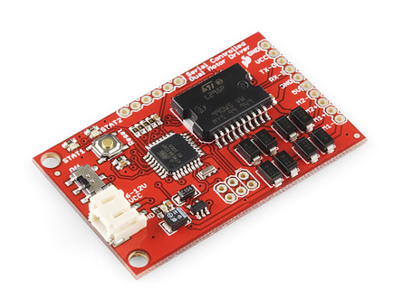

======================================
Case Study: Serial DC Motor Controller
======================================

This tutorial will walk you through connecting Parlay to the Serial
Controlled Motor Driver from Sparkfun. Details and specifications of the motor
controller can be found at https://www.sparkfun.com/products/9571.

Motor Controller Serial Interface
---------------------------------

The interface with the motor controller is very simple. The motor
controller drives two DC motors. Over a serial connection, we can
command the motors to spin with an ASCII string formatted like
"1f5\\r". There are three characters in the command, and
then it is terminated with a carriage return (not a newline character!).

-  1st character: "1" means motor 1, "2" means motor 2
-  2nd character: "f" means spin forward, "r" means spin in reverse
-  3rd character: "5" means spin at speed 5, in range 0-9. 0 is stopped,
   9 is 100% PWM.

The parameters for the serial interface are 115200 baud, 8-N-1.

Desired Commands
----------------

Since we are writing a custom Protocol and custom Item to interact with
this motor controller, we can decide how we want our users to interact
with our Item. The users don't have to know the serial interface
described above -- they can interact with the motors using commands that
we create. So, let's decide on the following requirements:

-  We want Motor 1 and Motor 2 to be separate Items
-  We want to have understandable commands for our motors: "Spin" and
   "Stop"
-  When we give our motor a "Spin" command, we want to be able to
   specify the speed as a positive or negative number
-  These commands should be translated into the correct serial string to
   be sent to the motor controller

The code
--------

Here is the code to achieve this. We will examine it a bit at a time.

.. code:: python

    from parlay.protocols.serial_line import ASCIILineProtocol, LineItem
    from parlay import parlay_command, start

    class SerialMotorControllerProtocol(ASCIILineProtocol):
        def __init__(self, port):
            super(SerialMotorControllerProtocol, self).__init__(port=port)
            self.items = [SerialMotorControllerItem(1, "Motor1", "Motor1", self),
                          SerialMotorControllerItem(2, "Motor2", "Motor2", self)]

        @classmethod
        def open(cls, broker, port="/dev/ttyUSB0"):
            return super(SerialMotorControllerProtocol, cls).open(broker, port=port, baudrate=115200, delimiter="\r")

    class SerialMotorControllerItem(LineItem):
        def __init__(self, motor_index, item_id, name, protocol):
            LineItem.__init__(self, item_id, name, protocol)
            self._motor_index = motor_index

        @parlay_command()
        def spin(self, speed):
            """
            Move the motor at a constant speed, between -9 and 9.  Negative speed causes motor to spin in reverse.
            :param speed: speed to move
            :type speed int
            :return: serial response from motor controller
            """
     
            speed = int(speed)
            if speed > 9 or speed < -9:
                raise ValueError("Speed outside range")  # this exception causes an error message to be sent back to whoever sent the command
            direction = "f" if speed >= 0 else "r"
            self.send_raw_data("{}{}{}".format(self._motor_index, direction, abs(speed)))

            # this waits for a response string from the motor controller, which will be shown in the UI as "result"
            return self.wait_for_data()

        @parlay_command()
        def stop(self):
            """
            Stop the motor
            :return: serial response from motor controller
            """
            # returns what spin() returns, which is the motor controller response string
            return self.spin(0)

    if __name__ == "__main__":

        # any protocol that has been imported or defined will be available to open
        #  so we do not need to instantiate anything before calling start()

        start()

The Protocol Class
------------------

The first step is to create our own Protocol class, which we will call
``SerialMotorControllerProtocol``.

.. code:: python

    class SerialMotorControllerProtocol(ASCIILineProtocol):

Parlay has pre-built Protocol classes for many common interfaces,
including delimited ASCII serial communication. The class that does this
is ``ASCIILineProtocol``, which will communicate over a serial line
using our specified COM port, baudrate, and delimiter character.

Override the ``__init__`` method
~~~~~~~~~~~~~~~~~~~~~~~~~~~~~~~~

To fulfill our requirements that we specified above, we must override
the ``__init__`` function and populate the ``self.items`` list with our
``SerialMotorControllerItem`` objects (described below). The items in
``self.items`` will be visible after the user has performed a discovery.

.. code:: python

        def __init__(self, port):
            super(SerialMotorControllerProtocol, self).__init__(self, port=port)
            self.items = [SerialMotorControllerItem(1, "Motor1", "Motor1", self),
                          SerialMotorControllerItem(2, "Motor2", "Motor2", self)]

Override the ``open`` class method
~~~~~~~~~~~~~~~~~~~~~~~~~~~~~~~~~~

``SerialMotorControllerProtocol`` inherits from ``ASCIILineProtocol``,
which inherits from ``BaseProtocol``. ``BaseProtocol`` has an ``open``
method that any child class *must* override. ``ASCIILineProtocol``
already does this, which handles setting up the serial port with the
desired settings.

For our motor controller, the baudrate and delimiter character are
specified by the hardware, so there's no need to make the user specify
that. So, in ``SerialMotorControllerProtocol``, we also override the
``open`` class method and specify the baudrate to be 115200 baud, and
the delimiter character to be "\\r", or carriage return.

The ``broker`` argument of the ``__open__`` function is required.

.. code:: python

        @classmethod
        def open(cls, broker, port="/dev/ttyUSB0"):
            return super(SerialMotorControllerProtocol, cls).open(broker, port=port, baudrate=115200, delimiter="\r")

When calling our parent's ``open`` method, we must use python's
``super`` function like so:
``super(SerialMotorControllerProtocol, cls).open(...)``

If we were to override ``open`` like below, our protocol would be shown
in the Parlay User Interface as a ``ASCIILineProtocol``, rather than a
``SerialMotorControllerProtocol`` like we want:

.. code:: python

        @classmethod
        def open(cls, broker, port="/dev/ttyUSB0"):
            # WRONG! DON'T DO THIS!
            return ASCIILineProtocol.open(broker, port=port, baudrate=115200, delimiter="\r")

Using the base class ``get_discovery`` method
~~~~~~~~~~~~~~~~~~~~~~~~~~~~~~~~~~~~~~~~~~~~~
``SerialMotorControllerProtocol`` inherits from ``ASCIILineProtocol``,
which inherits from ``BaseProtocol``.  ``BaseProtocol`` has a ``get_discovery``
method defined as follows:

.. code:: python

        def get_discovery(self):
            return {'TEMPLATE': 'Protocol',
                    'NAME': str(self),
                    'protocol_type': getattr(self, "_protocol_type_name", "UNKNOWN"),
                    'CHILDREN': [x.get_discovery() for x in self.items]}

For the base ``get_discovery`` method to work, the protocol must create a list
of items in ``self.items`` that each support their own ``get_discovery`` method.

We already took care of this in our ``__init__`` method as described above.  As
described below, our ``SerialMotorControllerItem`` class inherits from
``ParlayCommandItem``, which means that it supports the ``get_discovery`` method.

The Item
--------

The second step is to create our own Item class, which we will call
``SerialMotorControllerItem``. It inherits from ``LineItem``, which is a
pre-built class designed to work with a serial protocol. It provides the
helper function ``send_raw_data``, which we will use later to send our
commands out the serial port.

The ``__init__`` method
~~~~~~~~~~~~~~~~~~~~~~~

We must call our parent's **init** function (not necessary to use
``super`` here). We also store the provided ``motor_index`` in a member
variable so we can correctly format the command strings to be sent over
the serial port to the motor controller.

.. code:: python

    class SerialMotorControllerItem(LineItem):
        def __init__(self, motor_index, item_id, name, protocol):
            LineItem.__init__(self, item_id, name, protocol)
            self._motor_index = motor_index

The ``spin`` command
~~~~~~~~~~~~~~~~~~~~

``SerialMotorControllerItem`` inherits from ``LineItem``, which inherits
from ``ParlayCommandItem``. This base class takes care of a lot of grunt
work for you to make your command functions be discoverable and visible
in the Parlay User Interface.

To make a command that is visible in the UI, just create a function and
decorate it with ``@parlay_command``.

.. code:: python

        @parlay_command()
        def spin(self, speed):
            """
            Move the motor at a constant speed, between -9 and 9.  Negative speed causes motor to spin in reverse.
            :param speed: speed to move
            :type speed int   # the Parlay UI can use type hinting to force the user to enter an integer
            :return: serial response from motor controller
            """
            speed = int(speed)
            if speed > 9 or speed < -9:
                raise ValueError("Speed outside range")  # this exception causes an error message to be sent back to whoever sent the command
            direction = "f" if speed >= 0 else "r"
            self.send_raw_data("{}{}{}".format(self._motor_index, direction, abs(speed)))

            # this waits for a response string from the motor controller, which will be shown in the UI as "result"
            return self.wait_for_data()  

The ``stop`` command
~~~~~~~~~~~~~~~~~~~~

Stopping the motor is just sending it a ``spin`` command with speed = 0.
We can do that! Once again, we add the ``@parlay_command`` decorator to
the function.

.. code:: python

        @parlay_command()
        def stop(self):
            """
            Stop the motor
            :return: serial response from motor controller
            """
            # returns what spin() returns, which is the motor controller response string
            return self.spin(0)

Starting Parlay
---------------

If this file is called as a python script, such as
``$ python motor_controller.py``, we can start parlay automatically.
Otherwise, we can import this file in any other python file to use the
``SerialMotorControllerProtocol`` and ``SerialMotorControllerItem`` that
we have just defined.

.. code:: python

    if __name__ == "__main__":
        start()
