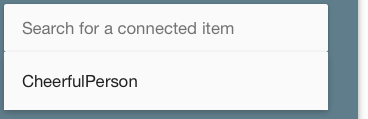
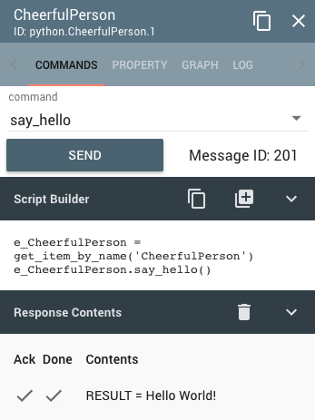

===========
Hello World
===========

This is the simplest demonstration of the parlay system. In this
tutorial, we will create a Parlay ``local_item`` object, use the Parlay
User Interface to send it a command, and view the response.

Create a ``local_item`` that says "Hello World!"
------------------------------------------------

Open a text editor and create a python script file named
"parlay\_hello.py" like so:

.. code:: python

    # parlay_hello.py

    from parlay import start, local_item, parlay_command, ParlayCommandItem

    @local_item(auto_connect=True)
    class CheerfulPerson(ParlayCommandItem):

        @parlay_command()
        def say_hello(self):
            return "Hello World!"

    if __name__ == "__main__":
        # this function call starts Parlay, and does not return
        start()

Save this script in any directory on your system.

Run the Hello World script
--------------------------

Use python to execute this script from the command line. For example, if
you saved the file to the C drive, you would open a command line, and
run the following command:

.. code:: bash

    c:\> python parlay_hello.py

Two things will now happen:

1) The parlay system will start running in the command line. Do not close 
   the command line window! 
2) Your default web browser will automatically open a new tab and go to 
   http://localhost:8080, where you will see the UI.

Parlay User Interface
---------------------

At the top of the user interface is a search bar that says "Search for a
connected item".

Click it, and you will see a dropdown with the item we created in the
script, "CheerfulPerson".

This brings up the item's card. By default, the card shows the available
commands, and in this case, there is only one command: say\_hello. Click
the "Send" button, and you will see the item's response.

That's it! You've just created a Parlay Command Item, defined a command,
run Parlay, viewed the item's card in the UI, sent the item a command,
and viewed the response.

Parlay UI is a web application
------------------------------

This illustrates an important aspect of Parlay that can be confusing to
first-time users:

**Parlay is a web server, and the user interface to Parlay is a web 
application.**

Parlay and the web browser are two separate applications, that in this
simple example, are both running on your computer. This architecture
confers huge advantages in more advanced use cases, where you can run
Parlay on your embedded device. However, it is a little different than
the typical stand-alone desktop application that many users are
accustomed to.

-  If you really want to be done with Parlay, you must close the command
   line window AND the browser tab.
-  If you just close the web browser, Parlay is *still running*. To shut
   down Parlay, close the command line window where you started Parlay.
   If you did not mean to close the browser, you can re-open your web
   browser and navigate to http://localhost:8080, and Parlay will show
   the user interface again.
-  If you close the command line window before the web browser, the
   browser will lose communication with Parlay and user interface top
   navigation bar will turn red. Run the python script again from a
   command line, and refresh your browser, and the UI will be ready
   again.
