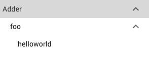
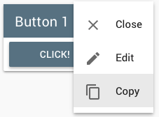
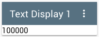
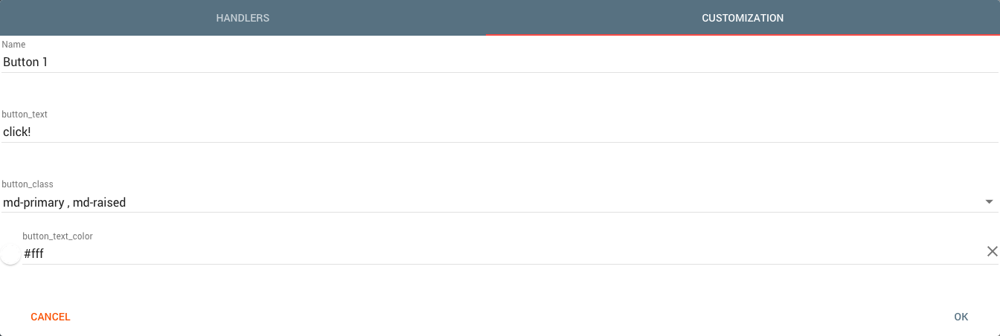
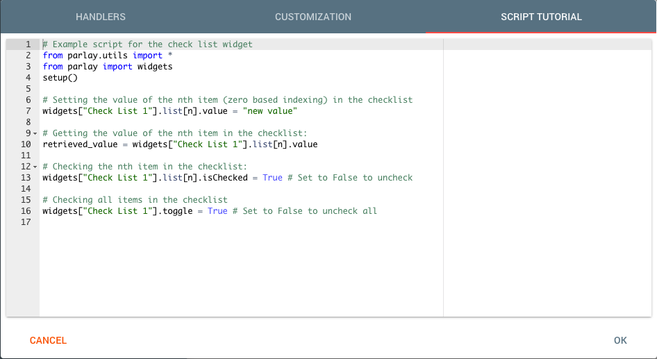
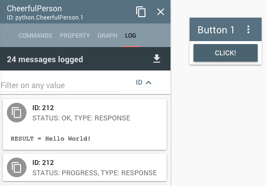
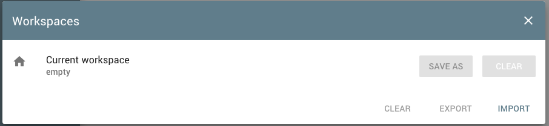
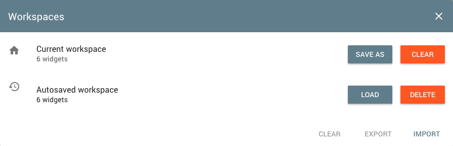
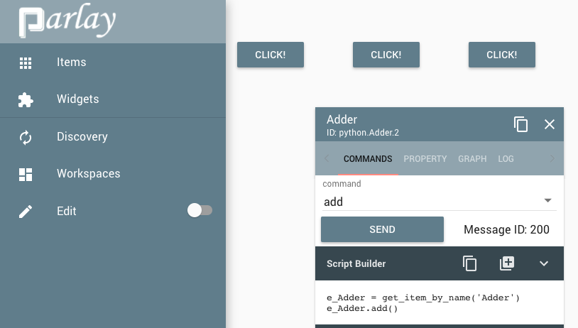

==============
User Interface
==============

The Parlay User Interface (UI) is a simple and powerful tool used to visualize and interact with your Parlay Items.
The UI is comprised of a workspace where you can add Item or widget Cards, and organize them by dragging and dropping
each card.

Items
-----

The items scripted in Python or connected to Parlay via a custom protocol can be added to the workspace.  By default,
a Parlay discovery request is made to the broker system (Parlay Connect).  After the discovery completes, all of your
items will be made available to add into the workspace.

Adding Items into the Workspace
~~~~~~~~~~~~~~~~~~~~~~~~~~~~~~~

Clicking the items menu option in the left side navigator will pull open a library of available items. Items will only
appear after a successful discovery. At the top most part of the library, there is a search bar where you can filter
your Items by name or ID.  Recall from the :doc:`hello_world` tutorial that clicking any of the items in the library
will launch an item card into the workspace.

If the item is hierarchical, you will be able to expand/collapse the item and view/hide its children items by clicking the chevron
icon on the right hand side of the item's displayed name/id.

After you have launched an item into the workspace, multiple functions of the item can be used. If you notice, the top
of the card has the both the name and ID of the item displayed for you.  On the right of the name text there will be
two icons.  The first icon, when clicked, will duplicated the card and display an exact copy of the item card tiled
over the original.  The second icon, intuitively, closes the card and removes it from the workspace. Lastly, the entire
title bar of the card is used as a handle to allow you to drag and drop the card anywhere within the workspace container.

On each item card you will see a few tabs:

-  Commands
-  Property
-  Graph
-  Log

Commands
~~~~~~~~

The command tab allows you to send commands/query actions to the Parlay Item.  You can select different
commands from the command drop down menu underneath the tab selectors.  If needed, an input field will be provided
to the selected command so that arguments can be passed to the command. If you recall from the :doc:`hello_world`
tutorial, clicking the send button underneath the selected command will send the command to the Parlay system and return
the response in the Response Contents section of the command tab.

Whenever the command selected changes, the contents of the script builder will also change. On the Script Builder
toolbar you will see three buttons. The most useful button in this section is the middle button, which will create a
button widget and copy the script and attach it to the button's click event handler.

.. image:: images/parlay_item_script_prompt.png
   :alt: Parlay Item Script Prompt

.. image:: images/parlay_item_script_widget.png
   :alt: Parlay Item Script Widget

.. image:: images/parlay_item_script.png
   :alt: Parlay Item Script Widget with attached script

Properties
~~~~~~~~~~

Each item has the capability to store and hold properties, which reflect and represent different values and states of
the item that you are working with.  With the property tab, you can get and set properties dynamically, either
individually or collectively.

.. image:: images/parlay_item_properties.png
   :alt: Parlay Item Properties

Note that some properties will be read only and others write only.  Read only properties will have their SET button
disabled and unusable and similarly, Write only properties will have their GET button disabled.

Graphs
~~~~~~

All item properties have the capability to be streamed.  This stream can be collected by the UI and streamed directly to
your item card in the form of a graph.  Clicking the graph tab will display a setting's cog icon.  Clicking this icon
will pop open a Configuration dialog for your card.

.. image:: images/parlay_item_graph_config.png
   :alt: Parlay Item Graph Configuration

In this configuration screen, you can select which property streams will be listened to and displayed on the graph.
Options to configure in this screen include the graph type (linear, bezier, step), the range of the y axis of the graph
and the interval at which the item requests data.

Once the configuration is complete, you will see a graph being displayed on the card.

.. image:: images/parlay_item_graph.png
   :alt: Parlay Item Graph Configuration

Logs
~~~~

When commands are sent, or properties are streamed, data is being sent back and forth between the UI and the Parlay
Connect (Broker) system.  These data transactions occur in small JSON messages.  You will see these messages in the
Log tab of the item card.  Through the input field on this tab, you can filter the logs based on a search string.
In the picture below, we filter for "Progress" and see all the messages that contain the word progress in them.

.. image:: images/parlay_item_logs.png
   :alt: Parlay Item Graph Configuration

Right next to the text that says "18 messages match" is a download icon.  Clicking this icon will prompt you to download
the filtered logs in a .txt file.  If a filter string is not provided, the entirety of the item's logs will be saved

Widgets
-------

Items are not the only thing that can be added to your workspace.  You can also add widgets, powerful tools that contain
scripting capabilities and can display data from other widgets or items.

Before diving into the functional behavior of widgets, let's take a look at how widgets are formatted.  Similar to the
items button on the side navigator, there is also a widgets button underneath the items button like so:

Clicking this will show all available widgets and allow you to add them to the workspace, or filter the widgets by their
name. Let's start by adding a button.  After clicking the button entry in the widget library we should see a widget
with the name "Button <number>" in the workspace.

.. image:: images/parlay_widget_button_default.png
   :alt: Parlay Widget Button

At the top of the widget we see a title bar.  Like items, the title bar can be used to drag and drop widgets. In the
upper right corner of the widget, there is an icon with three dots.  Clicking this will give you a menu of actions to
perform on the clicked widget.

The close and copy actions are identical to that of the item card. The most important aspect of the widget actions is
the edit action.  Clicking the edit action will display a configuration dialog for your widget, where you can
customize the widget to your liking.

Editing and Customizing Widgets
~~~~~~~~~~~~~~~~~~~~~~~~~~~~~~~

The widget edit dialog will have at most 3 tabs of the following categories: Handlers, Transformer, Customization and
Script Tutorial.

Widget Event Handlers
*********************

The Handler tab is only displayed for input widgets, ie, widgets that you can input actions to (button, checklist, text
input, etc.).  In the handler tab, you can select events that are bound to the widget and have a Python script run,
every time the widget event occurs.  The most common example of this is a button's "click" event.  Whenever the button
widget gets clicked, the Python script in the event handler will be run.

.. image:: images/parlay_widget_handler.png
   :alt: Parlay Widget Event Handler

The first three lines that are appended into the script for you should never be deleted! They are needed to interact
with the other Parlay Items and widgets in your workspace!

Widget Transformer
******************

The Transformer tab is only displayed for display widgets, ie, widgets that display information to the user.  Currently
there is only one display type widget, the text display widget.  The transformer tab lets you grab values from the
Parlay scope, such as Item properties and values, and modify them as needed.

.. image:: images/parlay_widget_transformer_chips.png
   :alt: Parlay Widget Transformer Data

Once the desired value is formulated in the script, it can be assigned to the "result" variable and will be displayed
to the screen.

.. image:: images/parlay_widget_transformer_script.png
   :alt: Parlay Widget Transformer Script

The final result will be reflected in your display widget.

Widget Customization
********************

The Customization tab is essentially how you modify the widget to your standard. Widget display names can be changed,
Dimensions can be changed (such as rows/tables of a table, or size of an image button) and much more.

We've already created a button in our workspace, but if you haven't do so yet, add one to your workspace. Click the edit
action in the widget's menu and head over to the customization tab.  You should see the following tab:

Let's change the name of our button from "Button 1" to "My Renamed Button".  Click OK to confirm to the changes and we
should now see the changes reflected on the Button's title bar.

.. image:: images/parlay_widget_renamed_button.png
   :alt: Parlay Widget Renamed Display Name

Widget Script Tutorial
**********************

Widgets that have properties bound to them should have a tab called the Script Tutorial. In this tab, there are
quick tutorials on how to access and modify the properties of the currently edited widget in another widget's script.

For example, if you add a checklist to your workspace, open the editing menu and move over to the Script Tutorial tab,
you will see how you could modify or read that checklist's data from another widget.

The great thing about this script tutorial tab is that if you rename the widget, all instances of the old name
in the tutorial become replaced with the new name. This makes scripting easier, as you can now just copy and paste
the script helper in the tutorial tab!

Widget Local Data Injection
***************************

Parlay Widgets have support for custom events.  These custom events have data bound to them, stored in a Python variable
named "local_data".  Widgets that have support for these local data injections will include a tutorial on how to
properly use the local_data variable in their script in the Event Handler tab.  Return to the checklist we just created
and move back to the Event Handler tab.  You should see a tutorial on all the possible ways you can use the local_data
variable in this event handler's script.

.. image:: images/parlay_widget_local_data.png
   :alt: Parlay Widget Local Data

Read the commented section on how to use the local_data variable. Now add the following line to the script:
::
   print local_data["value"]

Now fill in the checklist with the following data:

-  111
-  222
-  333
-  444
-  555

Proceed with checking any of the items in the checklist.  Did you notice that the checked item was printed to the
screen?

Widget Examples
---------------

There are three main functional ways to use widgets:

-  Send queries or commands to Parlay Items
-  Display Data from Parlay Items
-  Modify or read data from other widgets

Let's review an example of each one

Interacting with Parlay Items
~~~~~~~~~~~~~~~~~~~~~~~~~~~~~

For this example, we will be using the CheerfulPerson item that we created in the :doc:`hello world` tutorial. Now
create a button. Open the edit screen and go to the Event Handler tab.  After confirming that the "click" event is
selected, type in the following code:

.. code:: python

   cheerful_person = get_item_by_name("CheerfulPerson")
   cheerful_person.say_hello()

.. image:: images/parlay_widget_event_items_manipulation.png
   :alt: Parlay Widget Events and Item Manipulation

Confirm the changes by clicking OK and then click the button.  You won't see a noticeable change, but if we head over
to the logs of out CheerfulPerson item, we can see messages being passed from the Parlay Server to the interface every
time we click our newly created button!

Display Data from Parlay Items
~~~~~~~~~~~~~~~~~~~~~~~~~~~~~~

Review the `Widget Transformer`_ tab on this page!  Using the transformer tab as directed on this tutorial will
correctly display data from Parlay Items onto your display widgets!

Interacting with Other Widgets
~~~~~~~~~~~~~~~~~~~~~~~~~~~~~~

Recall from the `Widget Script Tutorial`_ that widgets that have properties can be modified by other widgets. Also
recall that each event handler has three lines prepended to the script that should never be deleted.  One of those lines
imports a variable called "widgets" which is a collection of all created widgets in our workspace.  Each widget can be
modified or read by any Python Script that is run within the UI.

For this example we will use two buttons and a checklist.  For the ease and clarity of this exercise, name the first
button "check/uncheck random item" and the second "set random item".  Name the checklist "list" and leave all items
blank.

In our "check/uncheck random item" button, after ensuring the "click" event is attached, type the following code below
the existing lines:

.. code:: python

   from random import randrange

   # get the checklist we want to modify
   checklist = widgets["list"]
   # get a random number 0-4
   index_to_change = randrange(5)

   # get the value of the checklist we want to modify
   isChecked = not checklist.list[index_to_change].isChecked
   # reverse the value of the checked
   checklist.list[index_to_change].isChecked = not isChecked

In our "set random item" button, add the following code:

.. code:: python

   from random import randrange

   # get the checklist we want to modify
   checklist = widgets["list"]
   # get a random number 0-4
   index_to_change = randrange(5)
   # get a random number 0-100
   random_val = randrange(101)

   # set random value to the value
   checklist.list[index_to_change].value = random_val

Now click both buttons and see how it modifies our list.  You should see that random items are getting checked
and unchecked and that the items input fields are being replaced with random numbers!

Discovery
---------

On the left Side Navigator, there is a button that says "Discovery". Clicking this button will request a discovery to
the Parlay Connect server.  Note that you MUST be connected to Parlay Connect for this to properly work.

Workspaces
----------

You may have noticed that by adding a few widgets and then later refreshing your page results in losing all widgets
in your workspace!  Fear not, this doesn't always have to happen.  Right underneath the discovery button in the left
side navigator, you should see another button that says "workspaces" on it.  Click it, and a dialog like the one below
should appear:

Saving and Clearing the Current Workspace
~~~~~~~~~~~~~~~~~~~~~~~~~~~~~~~~~~~~~~~~~

Try adding a few widgets and items, adding some small scripts to some of the widgets and reorganizing the placement of
the widgets via the drag and drop functionality.  Now reopen the workspaces dialog.  You should see "Current Workspace"
with the number of widgets you just added directly beneath it.  To the right you should see two buttons: "save as" and
"clear".  By clicking "save as", you will be prompted for a name for the workspace that you are about to save.
Workspace saving is extremely useful as it saves all widgets and items in your workspace as well as well as other meta
data attached to it.  Meta data attached to widgets includes the position of the widget or item, scripts attached to the
widget, streams enabled, and other data filled in the input fields (for widgets like tables and check lists). Clicking
clear is pretty self explanatory (and dangerous! use with caution).  Once clear is clicked all items and widgets in your
workspace are removed.  The only way to bring back widgets cleared is if you already have saved the workspace prior to
clearing it.

Autosave
~~~~~~~~

If you accidentally cleared the workspace but forgot to save it, there's a good chance that the auto save discovery
saved a partial or complete state of your cleared workspace.  If an auto saved discovery is available it will show in
the workspace dialog as seen below:

Managing Saved Workspaces
~~~~~~~~~~~~~~~~~~~~~~~~~

Any saved workspace (or autosaved workspace) will have a "load" button and a "delete" button to the right hand side
of its entry.  Clicking load will clear the current workspace and replace it with the workspace that you are loading.
Delete will remove the saved workspace from Parlay.  You will no longer have access to the deleted workspace, so take
caution when deleting workspaces you no longer need.

At the bottom of the workspace dialog there are three final buttons: "Clear", "Export" and "Import". The clear button
clears all saved workspaces. When clicking this button, you will be warned that this action cannot be undone.

Exporting and Importing Workspaces
**********************************

The export and import functions of the workspace is a very useful tool to be able to collaboratively work on projects
with other team mates, co-workers, class mates or colleagues. Clicking the export button will prompt you to download
a text file to your local system.  This exported file contains all of your saved workspaces (excluding the autosaved
workspace).  You can now send this file to a colleague, and they can import the file so they may work with the same
workspace that you just created.

In order to import a workspace, you must first click the import button.  Doing so will prompt you to select a text file
in your hard drive containing the data contents of the workspace.  After loading the workspace (this may take a few
econds to complete) you should see new workspaces made available for you to load onto your screen.

Editing Mode
------------

On the left side navigator there is a toggle switch next to the "Edit" label.  Clicking this switch will toggle the edit
mode on your screen.  You should notice that when the toggle is off, all of the title bars on each of the widgets
disappear. As long as edit mode is off, you will not be able to add widgets or items, nor will you be able to drag and
drop existing widgets.  Furthermore, an item card's title bar buttons will also be disabled.

.. Protocols
.. ---------

.. Notifications
.. -------------

.. Settings
.. --------
